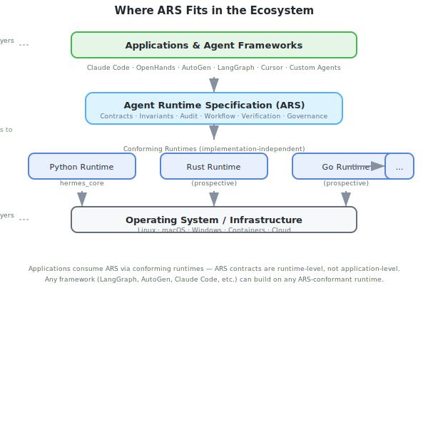
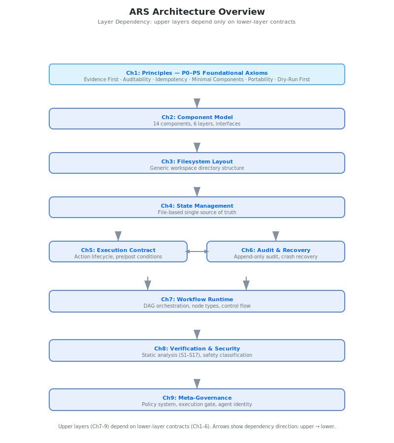
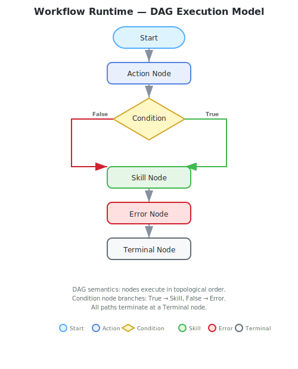
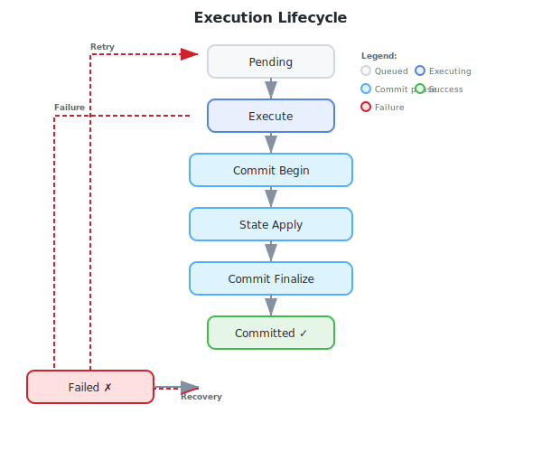
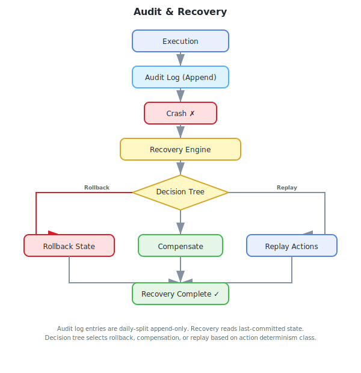
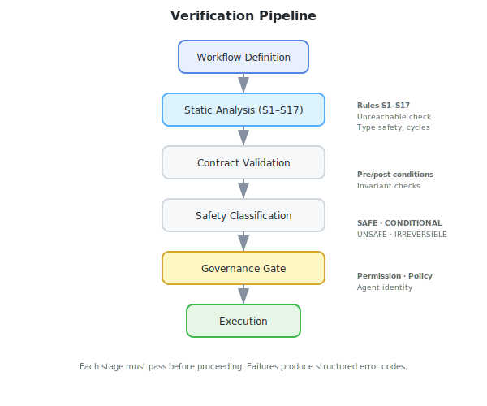
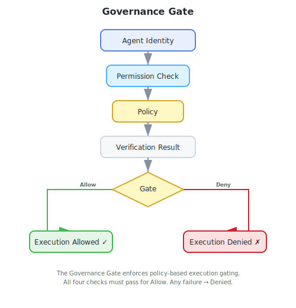

# Agent Runtime Specification (ARS)

> **A language-neutral runtime contract for autonomous AI agents.**

ARS defines **how AI agents execute—not what they do**.

Just as POSIX standardizes operating system interfaces and OpenAPI standardizes HTTP APIs, **Agent Runtime Specification (ARS)** standardizes the runtime semantics of autonomous AI agents, including execution, state management, auditing, recovery, workflow orchestration, verification, and governance.

The goal is simple:

> **One Specification. Multiple Implementations. Portable Agent Runtimes.**

---

# Why ARS?

Today's AI agent ecosystem is fragmented.

Every framework defines its own:

- Execution lifecycle
- Workflow model
- State management
- Audit mechanism
- Recovery strategy
- Permission model
- Governance model

As a result:

- Agents are difficult to migrate between runtimes.
- Runtime behavior is difficult to verify.
- Crash recovery is implementation-specific.
- Auditing lacks a common contract.
- Compliance cannot be tested uniformly.

ARS addresses this problem by defining a **common runtime contract** that any implementation can adopt.

Rather than standardizing prompts, models, or frameworks, ARS standardizes **runtime semantics**.

---

# Non-Goals

ARS explicitly does **not** define:

| Domain | Why |
|--------|-----|
| **Prompt engineering** | Prompt design is application-specific. ARS standardizes the runtime, not the interaction format. |
| **LLM APIs** | Model APIs belong to model providers, not runtime contracts. ARS works with any model. |
| **Memory architecture** | Memory systems are implementation-specific. ARS defines how execution is recorded, not how agents remember. |
| **User interfaces** | CLI, GUI, API — all are compatible. ARS governs what happens during execution, not how users interact. |
| **Planning algorithms** | Task decomposition, reflection, and planning belong to agent frameworks. ARS standardizes execution, not reasoning. |
| **Model providers** | OpenAI, Anthropic, local models — ARS is model-agnostic. |
| **Framework implementations** | LangGraph, AutoGen, Claude Code, etc. can all build on ARS-conformant runtimes. ARS does not replace them. |

These capabilities belong to **higher layers** (applications, frameworks, user interfaces). ARS provides the runtime foundation that they all share.

---

# Where ARS Fits



*ARS sits between applications and infrastructure: frameworks and agents build on conforming runtimes, runtimes implement ARS contracts.*

---

# Design Goals

ARS is designed with the following principles:

| Goal | Description |
|------|-------------|
| **Deterministic** | Identical inputs produce identical execution traces. Workflow DAGs guarantee static topology. |
| **Auditable** | Every execution produces an immutable, append-only audit record. Full traceability from input to outcome. |
| **Verifiable** | Workflows are statically analyzed before execution. 17 verification rules catch errors before they run. |
| **Recoverable** | Crash recovery from audit trail. Decision tree selects rollback, compensation, or replay. |
| **Minimal** | 9 chapters. 47 invariants. 17 verification rules. Nothing extraneous. |
| **Implementation-independent** | Specified abstractly. Any language, any framework, any platform can implement. |
| **Portable** | Workflows and audit logs work across runtimes. No vendor lock-in. |
| **Contract-driven** | Every runtime behavior is governed by a formal contract with pre/post conditions. |

---

# Who Is ARS For?

| Audience | Why ARS Matters |
|----------|-----------------|
| **Runtime developers** | Implement ARS contracts to produce a verifiable, compliant agent runtime. Start from a proven spec instead of designing from scratch. |
| **Framework authors** | Build your framework on ARS-conformant runtimes. Gain portable audit, verifiable workflows, and cross-runtime compatibility. |
| **Enterprise AI infrastructure teams** | Standardize agent runtime behaviour across teams. Enforce audit, governance, and recovery policies uniformly. |
| **Research projects** | Experiment with agent runtimes while maintaining compliance with a common specification. Compare implementations objectively. |
| **Agent platform developers** | Deploy agents on any ARS-conformant runtime. Audit logs and workflows are portable across platforms. |
| **System architects** | Design agent systems with clear runtime boundaries. Separate execution semantics from application logic. |

ARS is **not** intended for end users interacting with AI chatbots. It is a specification for the developers who build the systems underneath.

---

# Specification vs Implementation

```
                    Agent Runtime Specification

                           ARS v1.0
                      (Specification Only)

                               │
          defines runtime contracts and semantics
                               │
        ┌──────────────────────┼──────────────────────┐
        │                      │                      │
        ▼                      ▼                      ▼

 Python Runtime         Rust Runtime         Go Runtime
 (Reference)            (Future)             (Future)

        ▼                      ▼                      ▼

      AI Agents           AI Agents           AI Agents
```

**ARS is the specification.** The **Python reference implementation** is one of many possible runtimes.

---

# Core Capabilities

### Execution Contract

Formal Action lifecycle with:

- Preconditions
- Postconditions
- Determinism classification
- Rollback categories
- Typed error model

---

### Audit & Recovery

Append-only audit records provide:

- Immutable execution history
- Crash recovery
- Commit protocol
- Compensation support
- State reconstruction

---

### Workflow Runtime

Workflow execution based on a typed DAG model:

- Action Nodes
- Condition Nodes
- Skill Nodes
- Error Nodes
- Terminal Nodes

Static topology guarantees deterministic execution semantics.

---

### Static Verification

Before execution, workflows are verified using:

- Structural validation
- Contract validation
- Safety classification
- 17 verification rules
- 47 runtime invariants

---

### Governance

Policy-driven execution control including:

- Agent identities
- Permission system
- Governance gates
- Trust levels
- Multi-agent isolation

---

# Layered Architecture

```
┌─────────────────────────────────────────────────────────────┐
│  Ch9  Meta-Governance                                       │
├─────────────────────────────────────────────────────────────┤
│  Ch8  Verification & Security                               │
├─────────────────────────────────────────────────────────────┤
│  Ch7  Workflow Runtime                                      │
├──────────────────────┬──────────────────────────────────────┤
│ Ch5 Execution        │ Ch6 Audit & Recovery                 │
├──────────────────────┴──────────────────────────────────────┤
│  Ch4  State Management                                      │
├─────────────────────────────────────────────────────────────┤
│  Ch3  Filesystem Layout                                     │
├─────────────────────────────────────────────────────────────┤
│  Ch2  Component Model                                       │
├─────────────────────────────────────────────────────────────┤
│  Ch1  Principles                                            │
└─────────────────────────────────────────────────────────────┘
```

Each layer depends **only** on contracts provided by lower layers.

The architecture contains **no circular dependencies**.

Every contract promise terminates at a contract-guaranteed artifact.



*Layer dependency: upper layers depend only on lower-layer contracts. Arrows show dependency direction.*

---

# Diagrams

| Diagram | Description |
|---------|-------------|
|  | **Workflow Runtime** — DAG execution model: Start → Action → Condition (True/False) → Skill/Error → Terminal |
|  | **Execution Lifecycle** — Pending → Execute → Commit phases → Committed, with failure/recovery transitions |
|  | **Audit & Recovery** — Append-only audit log with crash recovery via decision tree (Rollback / Compensation / Replay) |
|  | **Verification Pipeline** — Static Analysis → Contract Validation → Safety Classification → Governance Gate → Execution |
|  | **Governance Gate** — Agent Identity → Permission → Policy → Verification Result → Allow / Deny |

---

# Repository Layout

```
ARS/
├── spec/                  # Frozen specification
│   └── v1.0/
├── docs/                  # Documentation (guides, conformance, ecosystem)
├── implementations/       # Conforming implementations
│   └── python/            # Python reference implementation (hermes_core)
├── reference/             # Reference indexes (glossary, invariants, contracts)
├── tests/                 # Implementation-independent compliance test suite
├── examples/              # Runnable examples by category
├── implementation/        # Implementation documentation
├── assets/                # Diagrams
├── scripts/               # Utility scripts
└── .github/               # GitHub configuration
```

---

# Quick Start

```python
from hermes_core import (
    WorkflowDefinition,
    WorkflowEngine,
    GovernanceGate,
    AgentIdentity,
    Permission,
    TrustLevel,
    NodeDefinition,
    NodeType,
)

from hermes_core.audit.audit_log import AuditLog
from pathlib import Path

# Configure audit
audit = AuditLog(Path("./audit"))

# Configure governance
gate = GovernanceGate()

gate.register_agent(
    AgentIdentity(
        agent_id="agent",
        trust_level=TrustLevel.TRUSTED
    )
)

gate.grant_permission(
    "agent",
    Permission(
        permission_id="execute",
        domain="execution",
        actions=["execute"]
    )
)

# Minimal workflow
workflow = WorkflowDefinition(name="hello")

workflow.add_node(
    NodeDefinition(
        node_id="end",
        type=NodeType.TERMINAL,
        terminal_status="completed"
    )
)

engine = WorkflowEngine(
    audit_log=audit,
    state_dir=Path("./state"),
    workspace="./workspace",
    agent_id="agent"
)

engine.gate = gate

result = engine.execute(
    workflow,
    inputs={},
    dry_run=True
)

print(result["status"])
```

---

# Specification

ARS v1.0 consists of **9 frozen chapters**.

| Chapter | Description | Status |
|----------|-------------|--------|
| Ch1 | Principles | ✅ Frozen |
| Ch2 | Component Model | ✅ Frozen |
| Ch3 | Filesystem Layout | ✅ Frozen |
| Ch4 | State Management | ✅ Frozen |
| Ch5 | Execution Contract | ✅ Frozen |
| Ch6 | Audit & Recovery | ✅ Frozen |
| Ch7 | Workflow Runtime | ✅ Frozen |
| Ch8 | Verification & Security | ✅ Frozen |
| Ch9 | Meta-Governance | ✅ Frozen |

Location:

```
spec/v1.0/
```

---

# Implementations

ARS is a **specification**, not a product. Any runtime can implement ARS by conforming to its contracts, invariants, verification rules, audit model, and governance model.

```
                ARS Specification v1.0
                        │
        ┌───────────────┼───────────────┐
        │               │               │
   Python Impl      Rust Impl        Go Impl
   (2,428 lines)   (prospective)   (prospective)
        │               │               │
        ▼               ▼               ▼
     AI Agent        AI Agent        AI Agent
```

### Python Reference Implementation

The repository currently includes **one** conforming implementation:

| Property | Value |
|----------|-------|
| Language | Python 3.11+ |
| Modules  | 25 (hermes_core) |
| Lines    | 2,428 |
| Coverage | Full Ch1–Ch9 |
| Status   | ✅ Verified against ARS Compliance Suite |
| Location | `implementations/python/` |

Install and verify:

```bash
cd implementations/python
pip install -e .
cd tests
python -m pytest -v
```

Future implementations in Rust, Go, Java, TypeScript, or other languages are welcome and should be added under `implementations/<language>/`.

---

# Compliance Suite

ARS includes an implementation-independent compliance suite.

Current coverage:

- 82 tests
- 47 invariants
- 17 verification rules
- 40+ runtime contracts

Run:

```bash
cd tests
python -m pytest -v
```

---

# Development

Install the Python reference implementation:

```bash
cd implementations/python
pip install -e .
```

Run compliance tests:

```bash
cd tests
python -m pytest -v
```

Verify specification artifacts:

```bash
python scripts/verify-spec.py
```

---

# FAQ

### Why not another framework?

ARS is **not** a framework — it is a **specification**. Frameworks like LangGraph, AutoGen, and Claude Code can all build on ARS-conformant runtimes. ARS standardizes what they share (execution, audit, verification, governance) without dictating how they work.

### How is ARS different from AGENTS.md?

AGENTS.md is a convention for defining agent behaviour through natural-language instructions. ARS is a formal runtime specification with typed contracts, verifiable invariants, and an implementation-independent test suite. AGENTS.md describes *what* an agent should do; ARS defines *how* execution happens.

### How is ARS different from MCP?

MCP (Model Context Protocol) standardizes how models connect to external tools and data sources. ARS standardizes how runtimes execute, audit, recover, and govern — the internal runtime semantics. MCP is about model ↔ tool communication; ARS is about runtime ↔ execution contracts. They are complementary.

### Can LangGraph implement ARS?

Yes. LangGraph can build a conforming runtime on top of its graph execution model by implementing ARS contracts for audit, recovery, verification, and governance.

### Can AutoGen implement ARS?

Yes. AutoGen's multi-agent orchestration can be wrapped in an ARS-conformant runtime, gaining portable audit traces and verifiable execution semantics.

### Can my own agent conform to ARS?

Yes. Any agent framework can implement ARS contracts. The specification is language-neutral and implementation-independent. The [Compliance Suite](#compliance-suite) provides a clear pass/fail test.

### Does ARS require Python?

No. The specification is language-neutral. The included Python reference implementation (`implementations/python/`) is one example. Rust, Go, TypeScript, and other implementations are welcome.

### Does ARS require Hermes?

No. Hermes is the name of the Python reference implementation's internal package (`hermes_core`). ARS is implementation-independent. The name "Hermes" appears only as an implementation detail, not as a project identity.

---

# Roadmap

| Version | Focus | Status |
|----------|-------|--------|
| v1.0 | Bootstrap Specification | ✅ Frozen |
| v1.1 | Audit consistency & replay verification | Planned |
| v1.2 | Multi-agent concurrency | Planned |

The v1.x series evolves through **backward-compatible extensions**.

---

# Vision

ARS aims to become a common runtime foundation for autonomous AI agents.

By separating **specification** from **implementation**, ARS enables:

- Portable runtimes
- Reproducible execution
- Formal verification
- Cross-platform interoperability
- Shared compliance tooling

The long-term vision is an ecosystem where multiple independent runtimes conform to the same execution contracts, enabling interoperability across agent frameworks, programming languages, and deployment platforms.

---

# License

MIT License.

See [LICENSE](LICENSE).

---

# Citation

```bibtex
@misc{ars2026,
  title  = {Agent Runtime Specification (ARS) v1.0},
  author = {ARS Contributors},
  year   = {2026},
  note   = {Python Reference Implementation}
}
```
